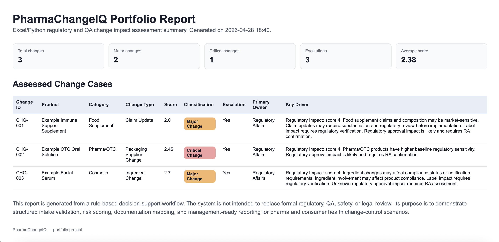

# PharmaChangeIQ

**PharmaChangeIQ** is an Excel/Python decision-support tool for regulatory and quality change impact assessment in pharma and consumer health.

The project simulates a realistic change-control workflow in which a proposed product, process, supplier, packaging, labelling, or claim-related change is assessed for its potential regulatory, quality, safety, supply-chain, and documentation impact.

## Visual overview

### Excel dashboard


### HTML portfolio report



## Business context

In pharma, consumer health, cosmetics, food supplements, and regulated product environments, even apparently small product changes can trigger significant downstream work.

Examples include:

- updating a product claim;
- replacing a supplier;
- changing packaging material;
- modifying a formulation ingredient;
- transferring manufacturing activities;
- updating label or artwork content.

These changes may require regulatory review, QA approval, supplier qualification, safety assessment, stability evaluation, artwork control, or formal escalation.

PharmaChangeIQ translates this type of operational reasoning into a lightweight, auditable workflow.

## Project objective

The goal of this project is to demonstrate how regulatory and QA change-control logic can be structured into a practical decision-support system.

The tool uses:

- a professional Excel template as the operational front-end;
- Python for validation, risk scoring, documentation mapping, and report generation;
- rule-based logic instead of black-box machine learning;
- automated outputs suitable for management-style review.

## Core workflow

The workflow is:

1. Fill the `Change_Intake` sheet in the Excel template.
2. Run the Python backend.
3. Validate the intake data.
4. Apply rule-based risk scoring.
5. Classify each change as Minor, Moderate, Major, or Critical.
6. Assign functional ownership.
7. Map required QA/RA documentation.
8. Generate an assessed Excel workbook.
9. Generate an HTML portfolio report.

## Main outputs

The backend generates:

- `data/output/PharmaChangeIQ_Assessed.xlsx`
- `reports/PharmaChangeIQ_Portfolio_Report.html`

The assessed Excel file includes:

- `Risk_Matrix`
- `Regulatory_Impact`
- `QA_Documentation`
- `Decision_Summary`
- `Portfolio_Assessment`
- `Dashboard`

## Example case studies

The template includes three example change-control scenarios:

| Change ID | Scenario | Expected classification |
|---|---|---|
| CHG-001 | Food supplement claim update | Major Change |
| CHG-002 | OTC primary packaging supplier change | Critical Change |
| CHG-003 | Cosmetic fragrance/ingredient replacement | Major Change |

## Risk assessment logic

The risk engine evaluates six areas:

- Regulatory Impact
- QA Impact
- Safety Impact
- Labelling Impact
- Supply Chain Impact
- Business Continuity Impact

Each area is scored from 0 to 4.

The final classification is based on:

- weighted risk score;
- escalation override rules for regulatory-critical scenarios;
- product category;
- change type;
- label, supplier, manufacturing, ingredient, and safety-data flags.

This approach is intentionally rule-based and auditable.


## Installation

Create and activate a clean Python environment:

```bash
conda create -n pharmachangeiq python=3.11 -y
conda activate pharmachangeiq
```

Install requirements:

```bash
pip install -r requirements.txt
```

## Usage

Generate the Excel template:

```bash
python src/create_excel_template.py
```

Run the assessment workflow:

```bash
python run_assessment.py
```

Optional: polish the generated Excel output for presentation:

```bash
python src/polish_excel_output.py
```

Run automated tests:

```bash
python -m pytest
```

## Quality checks

The project includes basic automated tests for:

- intake validation;
- rule-based risk scoring;
- documentation mapping.

Expected result:

```text
11 passed
```

## Project structure

```text
PharmaChangeIQ/
│
├── assets/
│   └── screenshots/
│       ├── excel_dashboard.png
│       └── html_report.png
│
├── config/
│   └── scoring_weights.yaml
│
├── data/
│   ├── input/
│   ├── output/
│   └── reference/
│
├── reports/
│   └── PharmaChangeIQ_Portfolio_Report.html
│
├── src/
│   ├── create_excel_template.py
│   ├── document_mapper.py
│   ├── excel_reader.py
│   ├── excel_writer.py
│   ├── polish_excel_output.py
│   ├── report_generator.py
│   ├── risk_engine.py
│   └── validator.py
│
├── templates/
│   └── PharmaChangeIQ_Template.xlsx
│
├── tests/
│   ├── test_document_mapper.py
│   ├── test_risk_engine.py
│   └── test_validator.py
│
├── README.md
├── requirements.txt
└── run_assessment.py
```


## Limitations

PharmaChangeIQ is a portfolio project and is not a validated regulatory, legal, clinical, GMP, or quality-management system.

The scoring rules are illustrative and should not be used for real regulatory or QA decisions without expert review, company-specific SOP alignment, and formal validation.

## Future improvements

Possible extensions include:

- PDF report export;
- more detailed market-specific regulatory rules;
- controlled configuration files for document requirements;
- improved Excel charts;
- audit trail generation;
- additional product categories and change types;
- separate detailed reports for each change case.
